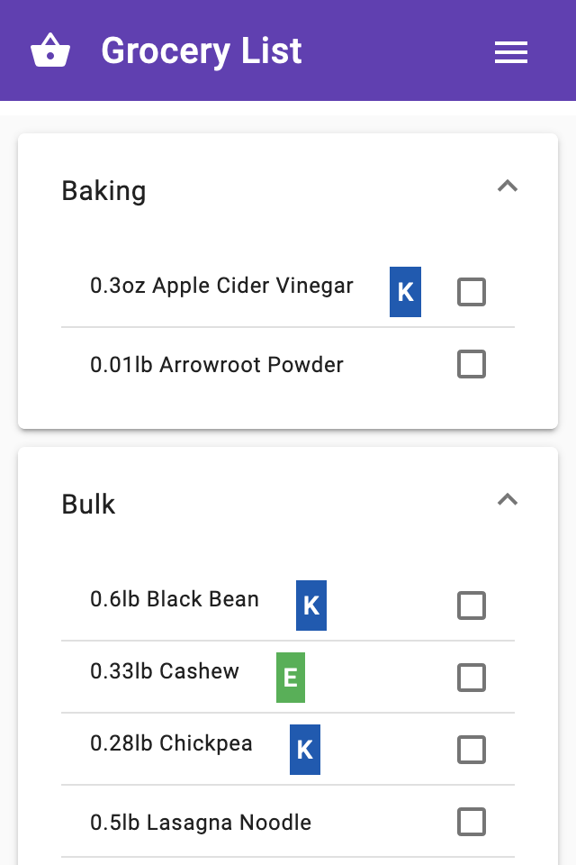

# Grocery List

An app to simplify and optimize grocery shopping. Build a meal plan then check off ingredients at the store. Stop forgetting what ingredients each recipe needs and focus on getting what you need, efficiently. 

Check it out [here](https://brianbrown.dev/groceries).

# Features

* Progressive Web App
* Local storage for checking off ingredients
* View ingredients for a recipe
* Change meal plan
* Flag suggested grocery store to buy ingredient

# Stack

* Angular 8
* Angular Material UI

# Setup

## Development

